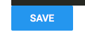

# LoadingButton [Repo](https://github.com/React-Quiver/LoadingButton)

LoadingButton written with React.

## Getting started
```
npm install
npm start
```

## Getting started
Advanced material-ui button to display status ('success', 'loading', 'error') for async actions.




